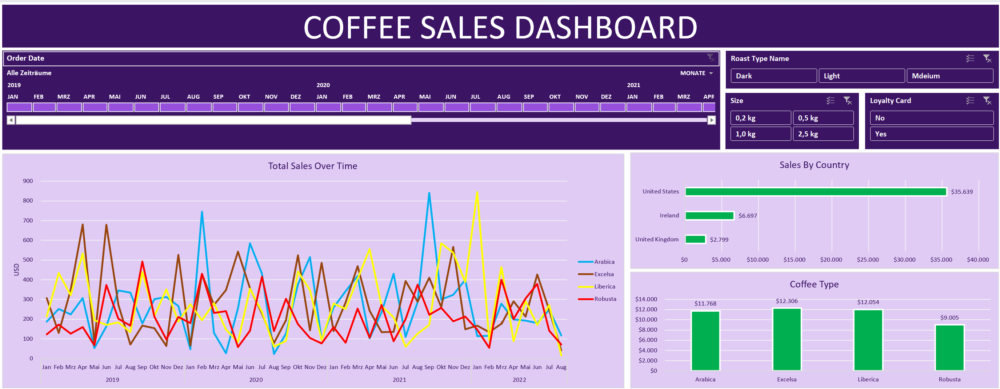

# Coffee-Sales-Dashboard---Umsatzanalyse
Das Dashboard dient der strukturierten Analyse der Umsätze im Kaffeeverkauf für den Zeitraum von 2019 bis 2022. Analysiert werden zeitliche Entwicklungen, Produktsegmente sowie die regionale Umsatzverteilung. Die Auswertung erfolgt auf aggregierter Ebene und ist interaktiv über Filter steuerbar.

## 1. Analyseziele

- **Trendidentifikation**  
  Erkennung langfristiger Umsatzentwicklungen sowie saisonaler Muster.

- **Produktoptimierung**  
  Identifikation leistungsstarker und schwächerer Kaffeesorten.

- **Marktbewertung**  
  Analyse regionaler Stärken sowie potenzieller Abhängigkeiten von einzelnen Märkten.

---

## 2. Datenquelle

- **Haupttabelle:** `orders`  
  Enthält Bestellnummer, Bestelldatum, Kundennummer, Produktnummer und Menge.

- **Referenztabellen:**
  - `customers` – Kundeninformationen (Name, E-Mail, Land, Treuekarten-Status)
  - `products` – Produktinformationen (Kaffeesorte, Rösttyp, Packungsgröße, Einzelpreis)

- **Zeitraum:** Januar 2019 – August 2022

- **Datenverknüpfung:**  
  Kunden- und Produktinformationen werden **dynamisch über Excel-Funktionen** in die Haupttabelle eingebunden.

---

## 3. Schlüsselkennzahlen

- **Umsatz (Sales)**  
  `Sales = Quantity × Unit Price`

- **Kaffeesorten:**  
  Rob (Robusta), Exc (Excelsa), Ara (Arabica), Lib (Liberica)

- **Rösttypen:**  
  L (Light), M (Medium), D (Dark)

- **Verpackungsgrößen:**  
  0.2 kg, 0.5 kg, 1 kg, 2.5 kg

- **Vertriebsregionen:**  
  USA, Irland, Großbritannien

---

## 4. Datenbereinigung & -aufbereitung

- Dynamische Integration der drei Tabellen mittels **XVERWEIS** sowie **INDEX/VERGLEICH**
- Vereinheitlichung von Datumsformaten und Behandlung fehlender Werte
- Prüfung auf doppelte Bestellungen sowie potenzielle Ausreißer

---

## 5. Tools & Methoden

- **Microsoft Excel** – Zentrale Analyse- und Visualisierungsplattform
- **Pivot-Tabellen** – Multidimensionale Datenaggregation und Exploration
- **Diagramme**
  - Liniendiagramme zur Trendanalyse  
  - Säulendiagramme für Regionenvergleiche  
  - Balkendiagramme zur Produktanalyse
- **Slicer** – Interaktive Filterung nach Jahr, Roast Type, Packungsgröße und Treuekarten-Status

---

## 6. Zentrale Erkenntnisse

- **Umsatztrend:**  
  Insgesamt schwankender, jedoch leicht aufsteigender Umsatzverlauf mit zunehmender Volatilität in den späteren Jahren.

- **Saisonalität:**  
  Wiederkehrende Umsatzspitzen in der zweiten Jahreshälfte (**Q3–Q4**).

- **Produkte:**  
  Excelsa und Liberica leisten einen wesentlichen Umsatzbeitrag, weisen jedoch starke Schwankungen auf.  
  Robusta zeigt die stabilste Umsatzentwicklung.

- **Regionale Verteilung:**  
  Deutliche Umsatzkonzentration auf den **US-Markt**.

- **Treuekarten-Status:**  
  Nicht-Mitglieder generieren höhere Gesamtumsätze; der durchschnittliche Transaktionswert von Mitgliedern liegt jedoch nur geringfügig unter dem von Nicht-Mitgliedern.

## 🎯 Dashboard Endergebnis

---

